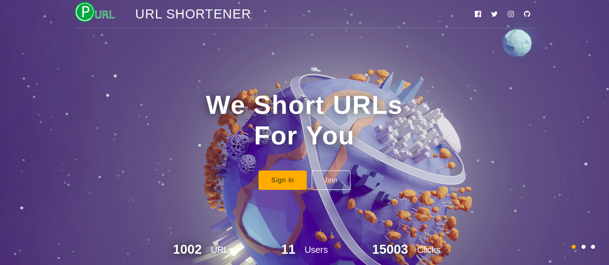
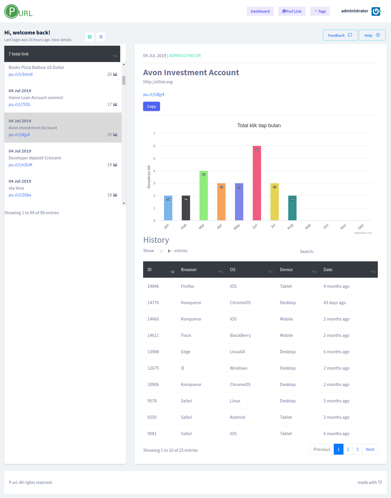
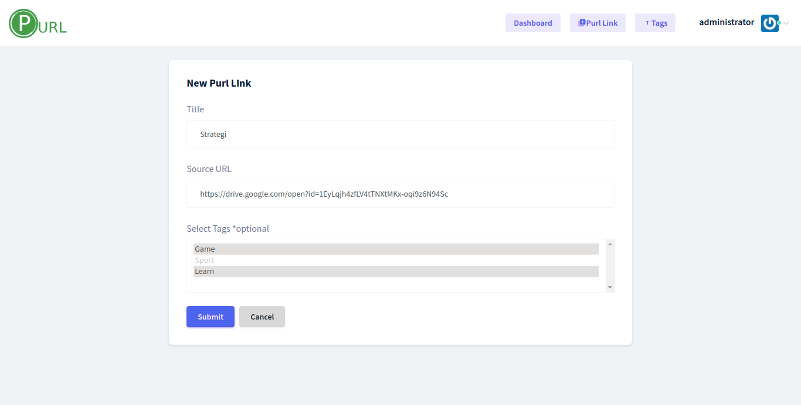
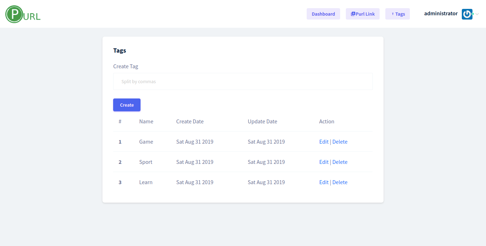

# urlshortener
URL shortener is a tool to convert your long and ugly URLS into short and attractive urls.

Build with:
- Express js (Nodejs framework)
- Ejs (Template engine)
- Postgres (Database)
- Sequelize (SQL ORM)
- Kapella (Admin Template)

**Thes project for eduction only**

## Heroku link:
https://pendekinurl.herokuapp.com/

## How to install
```
npm install

nodemon index.js
```

Don't forget to edit config!

| Model     | Name to use in Codes |
| --------- | -------------------- |
| Urls      | Url                  |
| UrlTags   | UrlTags              |
| Tags      | Tag                  |
| Histories | History              |

## Steps TO DO:

Template
- [x] Ladingpage
  - [x] Count url
  - [x] Count user
  - [x] Count click
  - [x] Design
- [ ] User
  - [x] Design registrasi
  - [x] Logic register
  - [x] Design login
  - [x] Logic login
  - [x] Logout
  - [ ] Verifikasi email
- [ ] URL
  - [x] Design dashboard URL
  - [x] List url
  - [x] Grafik url
  - [x] Total url
  - [x] Create url
  - [ ] Edit url
  - [ ] Delete url
- [x] Dashboard Grafik
- [ ] Profile
  - [ ] Design
  - [ ] Update profile
  - [ ] Upload foto (comot gravatar)
- [ ] Seeder
  - [x] URL
  - [x] User
  - [x] Tag
  - [x] UrlTags
  - [x] History
- [ ] Connect telegram

## Checklist:

- [x] CRUD
- [x] Class & Instance
- [x] Helper
- [x] Hooks
- [x] Middlewars
- [x] Session
- [x] MVP
- [x] Heroku

## Schema:


## Preview
**Ladingpage**


**Dashboard**


**Link**


**Tag**
