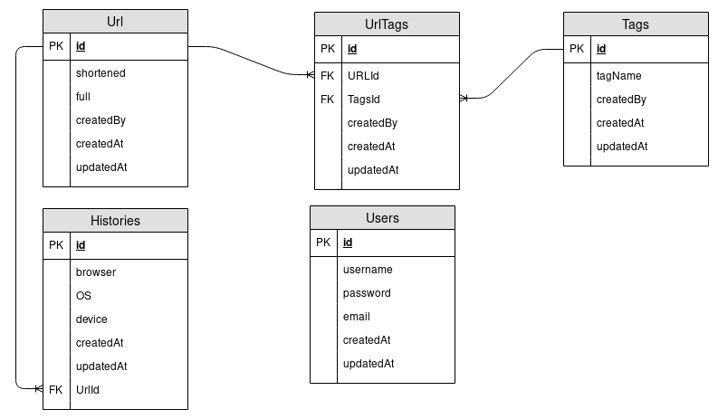

# urlshortener

## Heroku link:
https://pendekinurl.herokuapp.com/

Don't forget to edit config!

| Model     | Name to use in Codes |
| --------- | -------------------- |
| Urls      | Url                  |
| UrlTags   | UrlTags              |
| Tags      | Tag                  |
| Histories | History              |

## Steps TO DO:

Template
- [x] Ladingpage
  - [x] Count url
  - [x] Count user
  - [x] Count click
  - [x] Design
- [ ] User
  - [x] Design registrasi
  - [x] Logic register
  - [x] Design login
  - [x] Logic login
  - [x] Logout
  - [ ] Verifikasi email
- [ ] URL
  - [ ] Design dashboard URL
  - [ ] List url
  - [ ] Grafik url
  - [ ] Total url
  - [ ] Create url
  - [ ] Edit url
  - [ ] Delete url
- [ ] Dashboard Grafik
- [ ] Profile
  - [ ] Design
  - [ ] Update profile
  - [ ] Upload foto (comot gravatar)
- [ ] Seeder
  - [x] URL
  - [ ] User
  - [ ] Tag
  - [ ] UrlTags
  - [ ] History
- [ ] Connect telegram

## Checklist:

- [ ] CRUD
- [ ] Class & Instance
- [ ] Helper
- [ ] Hooks
- [ ] Middlewars
- [ ] Session
- [ ] MVP
- [ ] Heroku

## Schema:
